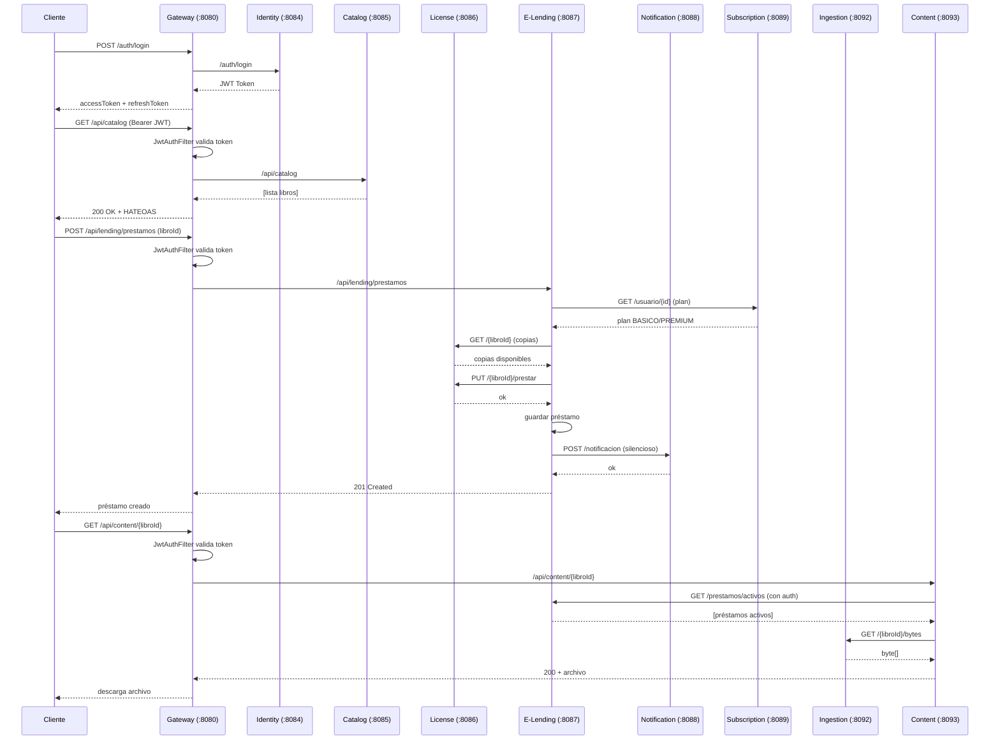

# Mapa de Comunicaciones — SmallBooks

> **Diagramas de comunicación entre microservicios, flujos end-to-end y análisis de acoplamiento.**

---

## 1. Diagrama General de Comunicaciones

```
                            ┌────────────────────────────┐
                            │      API Gateway :8080      │
                            │   (Spring Cloud Gateway)    │
                            │   + JwtAuthFilter           │
                            └────────────────────────────┘
                                      │
        ┌─────────────────────────────┼─────────────────────────────┐
        │               ┌─────────────▼─────────────┐               │
        │               │      Eureka Server        │               │
        │               │      Service Discovery    │               │
        │               └───────────────────────────┘               │
        │                         │                                 │
        │     (Todos los MS se registran en Eureka)                 │
        │                                                           │
   ┌────▼──────────────────────────────────────────────────────┐   │
   │                     Comunicación Feign                     │   │
   │                  (Llamadas HTTP síncronas)                 │   │
   └───────────────────────────────────────────────────────────┘   │
                                                                   │
   ┌──────────────────────────────────────────────────────────────┐│
   │                    MICROSERVICIOS DE NEGOCIO                  ││
   └──────────────────────────────────────────────────────────────┘│
                                                                   
┌─────────┐    ┌─────────┐    ┌─────────┐    ┌─────────┐    ┌─────────┐
│ Identity│    │ Catalog │    │ License │    │Subscrip.│    │ Notific.│
│ :8084   │    │ :8085   │    │ :8086   │    │ :8089   │    │ :8088   │
└─────────┘    └────┬────┘    └────┬────┘    └────┬────┘    └────┬────┘
                    │              │              │              │
                    │              │     ┌────────┘              │
                    │              │     │                       │
                    │         ┌────▼─────▼──────┐               │
                    │         │   E-Lending     │───────────────┘
                    │         │   :8087         │  POST /notifications
                    │         │   (Préstamos)   │
                    │         └────────┬────────┘
                    │                  │ (scheduler)
                    │         ┌────────▼────────┐
                    │         │ License (vuelve │
                    │         │ a llamar para   │
                    │         │ devolver copias)│
                    │         └─────────────────┘
                    │
┌─────────┐    ┌────▼────┐    ┌─────────┐    ┌─────────┐
│ Search  │────▶ Catalog │    │Analytics│────▶Elending │
│ :8090   │    │ :8085   │    │ :8091   │    │ :8087   │
└─────────┘    └─────────┘    └─────────┘    └─────────┘

┌─────────┐    ┌─────────┐    ┌─────────┐
│ Content │────▶Elending │────▶Ingestion│
│ :8093   │    │ :8087   │    │ :8092   │
└─────────┘    └─────────┘    └─────────┘
```

---

## 2. Matriz de Comunicación

| Microservicio Origen | Feign Client | Destino | Endpoint Llamado | Propósito | ¿Crítico? |
|---------------------|-------------|---------|-----------------|-----------|-----------|
| **elending-service** | `SubscriptionClient` | subscription-service | `GET /api/subscriptions/usuario/{usuarioId}` | Obtener plan y límites del usuario | ✅ Sí (falla → plan BASICO por defecto) |
| **elending-service** | `LicenseClient` | license-service | `GET /api/licenses/{libroId}` | Verificar copias disponibles | ✅ Sí |
| **elending-service** | `LicenseClient` | license-service | `PUT /api/licenses/{libroId}/prestar` | Descontar 1 copia | ✅ Sí |
| **elending-service** | `LicenseClient` | license-service | `PUT /api/licenses/{libroId}/devolver` | Devolver copia (compensación/scheduler) | ✅ Sí |
| **elending-service** | `NotificationClient` | notification-service | `POST /api/notifications` | Crear notificación | ❌ No bloqueante |
| **search-service** | `CatalogClient` | catalog-service | `GET /api/catalog` | Obtener todos los libros | ✅ Sí |
| **search-service** | `CatalogClient` | catalog-service | `GET /api/catalog/buscar` | Buscar libros | ✅ Sí |
| **search-service** | `CatalogClient` | catalog-service | `GET /api/catalog/disponibles` | Obtener disponibles | ✅ Sí |
| **analytics-service** | `LendingClient` | elending-service | `GET /api/lending/prestamos/todos` | Obtener todos los préstamos | ✅ Sí |
| **analytics-service** | `LendingClient` | elending-service | `GET /api/lending/prestamos/historial/{usuarioId}` | Historial de usuario | ✅ Sí |
| **content-service** | `LendingClient` | elending-service | `GET /api/lending/prestamos/activos` | Verificar préstamo activo | ✅ Sí |
| **content-service** | `IngestionClient` | ingestion-service | `GET /api/ingestion/{libroId}/bytes` | Obtener bytes del archivo | ✅ Sí |

---

## 3. Flujos End-to-End

### 3.1 Flujo de Registro de Usuario

```
Cliente                     API Gateway              Identity Service
   │                            │                         │
   │  POST /auth/register       │                         │
   │───────────────────────────>│                         │
   │                            │  POST /auth/register    │
   │                            │────────────────────────>│
   │                            │                         │
   │                            │  Validar datos          │
   │                            │  Verificar username     │
   │                            │  BCrypt(password)       │
   │                            │  Guardar en db_identity │
   │                            │                         │
   │                            │  201 Created            │
   │                            │<────────────────────────│
   │  201 Created               │                         │
   │<───────────────────────────│                         │
```

### 3.2 Flujo de Login y Consumo

```
Cliente                     Gateway               Identity          Otro MS
   │                           │                     │                 │
   │ POST /auth/login          │                     │                 │
   │──────────────────────────>│  POST /auth/login   │                 │
   │                           │────────────────────>│                 │
   │                           │                     │ Validar creds  │
   │                           │                     │ Generar JWT    │
   │                           │  200 {accessToken,  │                 │
   │                           │        refreshToken}│                 │
   │                           │<────────────────────│                 │
   │ 200 {accessToken,         │                     │                 │
   │     refreshToken}         │                     │                 │
   │<──────────────────────────│                     │                 │
   │                           │                     │                 │
   │ GET /api/catalog          │                     │                 │
   │ Authorization: Bearer ... │                     │                 │
   │──────────────────────────>│                     │                 │
   │                           │ JwtAuthFilter:      │                 │
   │                           │ 1. ¿Bearer existe?  │                 │
   │                           │ 2. Validar firma    │                 │
   │                           │ 3. ¿type=access?    │                 │
   │                           │                     │                 │
   │                           │ GET /api/catalog    │                 │
   │                           │──────────────────────────────────────>│
   │                           │                     │                 │
   │                           │ 200 [lista libros]  │                 │
   │                           │<──────────────────────────────────────│
   │ 200 [lista libros]        │                     │                 │
   │<──────────────────────────│                     │                 │
```

### 3.3 Flujo de Creación de Préstamo (7 Pasos)

```
Cliente          Gateway       E-Lending         Subscription    License     Notification
   │                │             │                  │            │             │
   │ POST /lending  │             │                  │            │             │
   │───────────────>│             │                  │            │             │
   │                │ JWT Auth OK │                  │            │             │
   │                │────────────>│                  │            │             │
   │                │             │                  │            │             │
   │                │             │ 1. GET /usuario/ │            │             │
   │                │             │    {usuarioId}   │            │             │
   │                │             │─────────────────>│            │             │
   │                │             │   200 {BASICO:2,7}│           │             │
   │                │             │<─────────────────│            │             │
   │                │             │                  │            │             │
   │                │             │ 2. Verificar límite           │             │
   │                │             │    (activos < max)            │             │
   │                │             │                  │            │             │
   │                │             │ 3. Verificar duplicado        │             │
   │                │             │                  │            │             │
   │                │             │ 4. GET /{libroId}│            │             │
   │                │             │──────────────────────────────>│             │
   │                │             │   200 {copias}   │            │             │
   │                │             │<──────────────────────────────│             │
   │                │             │                  │            │             │
   │                │             │ 5. PUT /{id}/    │            │             │
   │                │             │    prestar       │            │             │
   │                │             │──────────────────────────────>│             │
   │                │             │   200 {ok}       │            │             │
   │                │             │<──────────────────────────────│             │
   │                │             │                  │            │             │
   │                │             │ 6. Guardar en BD │            │             │
   │                │             │    (prestamos)   │            │             │
   │                │             │    └→ Si falla:  │            │             │
   │                │             │       PUT /devolver (comp.)   │             │
   │                │             │──────────────────────────────>│             │
   │                │             │                  │            │             │
   │                │             │ 7. POST /notif   │            │             │
   │                │             │──────────────────────────────────────────>│
   │                │             │   (silencioso)   │            │             │
   │                │             │                  │            │             │
   │                │  201 Created│                  │            │             │
   │                │<────────────│                  │            │             │
   │ 201 Created    │             │                  │            │             │
   │<───────────────│             │                  │            │             │
```

### 3.4 Flujo de Descarga de Contenido

```
Cliente          Gateway       Content           E-Lending        Ingestion
   │                │             │                  │               │
   │ GET /content/  │             │                  │               │
   │ {libroId}      │             │                  │               │
   │───────────────>│             │                  │               │
   │                │ JWT Auth OK │                  │               │
   │                │────────────>│                  │               │
   │                │             │                  │               │
   │                │             │ GET /prestamos/  │               │
   │                │             │   activos        │               │
   │                │             │ (con authHeader) │               │
   │                │             │─────────────────>│               │
   │                │             │ 200 [lista]      │               │
   │                │             │<─────────────────│               │
   │                │             │                  │               │
   │                │             │ Verificar:       │               │
   │                │             │ ¿tiene préstamo  │               │
   │                │             │  activo del      │               │
   │                │             │  libroId?        │               │
   │                │             │                  │               │
   │                │             │ GET /{libroId}/  │               │
   │                │             │   bytes          │               │
   │                │             │────────────────────────────────>│
   │                │             │  200 [byte[]]    │               │
   │                │             │<────────────────────────────────│
   │                │             │                  │               │
   │                │ 200 bytes   │                  │               │
   │                │<────────────│                  │               │
   │ 200 [archivo]  │             │                  │               │
   │<───────────────│             │                  │               │
```

### 3.5 Flujo del Scheduler de Vencimientos

```
   Cada 1 hora:
   
   E-Lending Service
        │
        ├─ 1. Buscar prestamos ACTIVOS con fechaVencimiento < ahora
        │
        ├─ 2. Por cada vencido:
        │      ├─ PUT /api/licenses/{libroId}/devolver (License Service)
        │      ├─ Actualizar estado a VENCIDO en BD
        │      └─ POST /api/notifications (Notification Service)
        │
        └─ 3. Buscar prestamos ACTIVOS con vencimiento en ≤ 2 días
             └─ Por cada próximo a vencer:
                  └─ POST /api/notifications (tipo: PROXIMO_VENCER)
```

---

## 4. Análisis de Acoplamiento

### 4.1 Dependencias Fuertes (Acoplamiento Síncrono)

E-Lending Service tiene el mayor número de dependencias (3 Feign clients), lo que lo convierte en el **punto crítico de la arquitectura**:

| Servicio | Dependencias | Riesgo |
|----------|-------------|--------|
| **elending-service** | subscription, license, notification | ⚠️ Alto — si subscription o license fallan, no se pueden crear préstamos |
| **content-service** | elending, ingestion | ⚠️ Medio — si elending o ingestion fallan, no se puede descargar contenido |
| **search-service** | catalog | 🟢 Bajo — servicio de solo consulta |
| **analytics-service** | elending | 🟢 Bajo — servicio de solo consulta |

### 4.2 Tratamiento de Fallos

| Feign Client | Estrategia | Comportamiento ante fallo |
|-------------|-----------|--------------------------|
| `SubscriptionClient` | Try-catch + fallback | Si falla → plan BASICO por defecto (2 préstamos, 7 días) |
| `LicenseClient` | Try-catch | Si falla → excepción, no se crea el préstamo |
| `NotificationClient` | Try-catch | Si falla → log warning, no bloquea el flujo |
| `CatalogClient` | Try-catch | Si falla → excepción, no hay resultados |
| `LendingClient` (analytics) | Try-catch | Si falla → excepción, sin estadísticas |
| `LendingClient` (content) | Try-catch | Si falla → excepción, sin descarga |
| `IngestionClient` | Try-catch | Si falla → excepción, sin descarga |

### 4.3 Patrón de Compensación

El flujo de préstamo implementa un **Saga coreográfico básico**:

```
Paso 5: Descontar copia (License Service) ✓
Paso 6: Guardar préstamo en BD → FALLA
         └→ Compensación: Devolver copia (License Service) ✓
```

### 4.4 Acoplamiento por Identidad Compartida

Los microservicios comparten identificadores por convención, no porFK en BD:

| Identificador | Servicios que lo usan |
|--------------|----------------------|
| `usuarioId` (String, username) | identity, subscription, elending, notification, analytics, content |
| `libroId` (Long) | catalog, license, elending, notification, ingestion, content |

---

## 5. Diagrama de Secuencia General (Mermaid)



> **Nota**: Este diagrama Mermaid renderiza correctamente en cualquier visor compatible con Mermaid (GitHub, GitLab, Notion, etc.).
